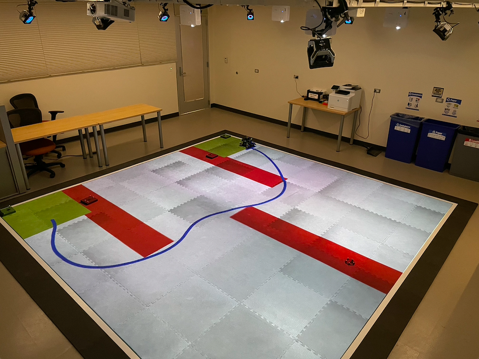
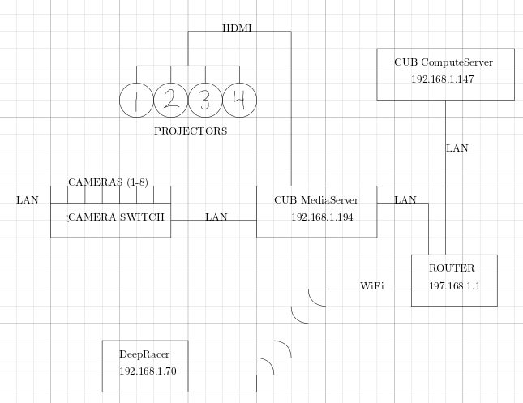
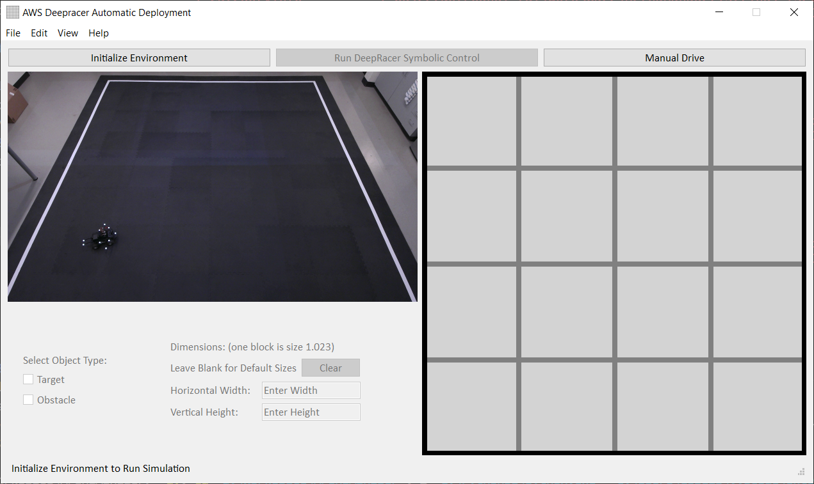
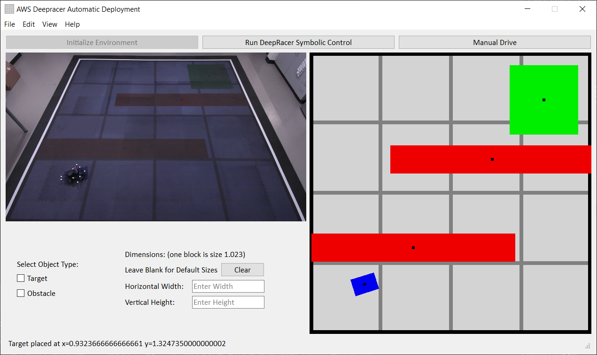
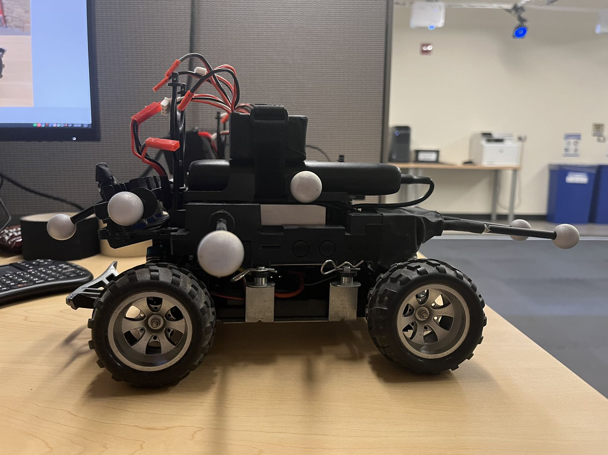
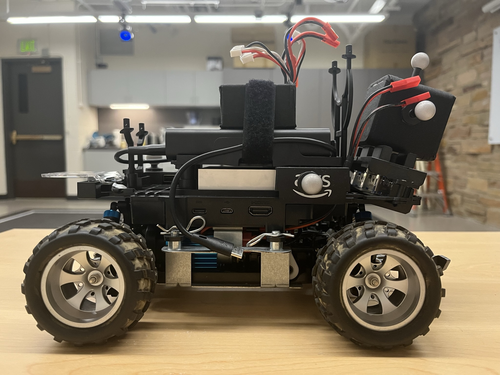

# CUBLab



The photo above demonstrates how everything looks once it is up and running. The red boxes represent the obstacles, the green boxes represent the targets, and the blue line is the path that the DeepRacer robot has taken to get to the obstacle. The cameras can be seen above the arena, which are responsible for tracking the locations of each rigid body within the arena, as well as the movement of the DeepRacer robot. 

## Lab Organization


The lab is set up with two servers connected to the router. The CUBLab Media Server is connected to the Cameras Switch, which powers the 8 OptiTrack cameras surrounding the arena in the lab. It is also connected via HDMI to 4 projectors spaced around the arena. The router also connects to the DeepRacer robot via Wi-Fi. 

## Required Software

### OptiTrack Motive

[OptiTrack Motive](https://optitrack.com/software/) is the software used alongside with the 8 cameras in the lab to track rigid body data within the arena. 

### Ventuz

[Ventuz](https://www.ventuz.com/downloads/) is the software used to congiure the images from all 4 projectors into one, without overlaps of the images. 

### OptiTrackRESTServer

The [OptiTrackRESTServer application](https://github.com/HyConSys/OptiTrackRESTServer) is the localization server, used to retrieve each rigid body's location within the arena. While running, the server will display information at [MediaServerIP:12345/OptiTrackRESTServer](192.168.1.194:12345/OptiTrackRESTServer).

### NDIRestServer

The [NDIRestServer application](https://github.com/HyConSys/NDIRestServer) is used to present the images corresponding to the locations of the various rigid bodies within the arena, and present them using a Ventuz presentation.

### DeepRacer-utils

[Deepracer-utils](https://github.com/HyConSys/deepracer-utils) is a series of code and examples which are used to access and control the AWS DeepRacer.

## Starting the Lab

1. First make sure that the cameras, all four projectors, the DeepRacer and the Compute Module are turned on and running.

2. Open up terminal and type in the following command:

    ```ps
    cd D:/Workspace/ArenaManager
    python AutoDeploy.py
    ```

    This command will run the GUI application for quick deployment.

    
3. Click on the "Initialize Environment" button located on the top-left corner. All necessary software will begin starting up, the process will take approximately 30 seconds.

4. Once everything is up and running, start placing markers to the scene, or place virtual objects by selecting the object type, enter object size (leave blank for default sizes), and click on the simulation on the right to place object where mouse is pointed. Move added object position by click and drag black dots centered on each object (marker objects cannot be moved).

    
    
5. Save the current configuration by clicking File -> Save Current Objects Configuration, or Ctrl + S, which will save the all virtual objects position and sizes into a .json file. Load other .json files by clicking File -> Load Objects Configuration, or Ctrl + O. Undo last edit by clicking Edit -> Undo or Ctrl + Z.

6. Now we can start running the symbolic controller for the DeepRacer by clicking on button "Run DeepRacer Symbolic Control". Symbolic control server in Compute Module will start running and script [sym_control.py](https://github.com/HyConSys/deepracer-utils/tree/main/examples/sym_control) in DeepRacer will fetch valid actions from symbolic control server to reach and avoid. Make sure at least one target is placed for the controller to run successfully. Move targets or obstacles on the fly, the symbolic controller will notice the changes and adjust to approprieate actions.

7. Click on button "Manual Drive" to use arrow keys to manually drive the DeepRacer. Hit "Esc" on keyboard to exit manual drive.

## Video Demo

For video demos, visit [HyConSys Lab Youtube](https://www.youtube.com/channel/UCcI8WWWJ7LFaPKLJnH9tNXA)

# More Notes for Robotic Platform

## Lab Organization

**Media Server:**

  - IP Address: 192.168.1.194
  
  - Duties: Motive, Localization Server, Auto Deploy GUI, Projection

**Compute Server:**

  - IP Address: 192.168.1.147

  - Duties: Sybolic Controller Server, OmegaThreads

## AWS DeepRacer

The 2 AWS DeepRacers in the lab:

- DeepRacer 1 is the car with a lot of markers sticking way out.

  

  **IP Address:** 192.168.1.70

  **System:** ROS 1 on Ubuntu

  **Start Up:**
  ```bash
  source /opt/aws/deepracer/setup.sh
  python ~/deepracer-utils/put_best_cal.py
  ```

  **Calibration:**
  Calibration needs to be performed on startup manually via python script in **~/deepracer-utils/put_best_cal.py**.

  **Source Code:**
  See [HyConSys/deepracer-utils](http://github.com/HyConSys/deepracer-utils/tree/main) for source code and more documentation

- DeepRacer 2 is the car with less markers and has a led panel on when powered up.
  
  

  **IP Address:** 192.168.1.110

  **System:** ROS 2 Foxy on Ubuntu

  **Start Up:**
  ```bash
  source /opt/ros/foxy/setup.bash
  source /root/deepracer_ws/aws-deepracer-servo-pkg/install/setup.sh
  ```

  **Calibration:**
  Calibration can be performed in the robot's device console web page at the IP address of the robot and is reused every time after start up.

  **Source Code:**
  See [Jeffreyyao/deepracer-utils](http://github.com/Jeffreyyao/deepracer-utils/tree/main) for source code and more documentation


## Motive & Localization Server
The Motive software along with Localization Server works together to provide accurate location for marker objects in the arena.

Start Motive best calibration in **D:\Workspace\CUBLab\8-Pime17-Calibrations\best_calibration.cal**, then start up the localization server in **D:\Workspace\OptiTrackRESTServer\start_admin.bat**. A GET requrest on the url address http://localhost:12345/OptiTrackRestServer will return object position information for each object recognized by Motive:
```json
{"DeepRacer1":"26.230331, -0.942712, -0.910002, -1.631047, 0.001046, 0.25, 0.35"}
```
with the following format:
```json
{"Object_Name": "Time_Elapsed, X_Position, Y_Position, Rotation_Radian, Speed, X_Size, Y_Size"}
```

To add "virtual" objects without a marker pattern to be recognized to the localication server, an example with a PUT request to add and a DEL request to delete in Python:
```python
import RESTApiClient
rest_client = RESTApiClient.RESTApiClient(localization_server_url)
# add a virtual object "Obstacle11" to localization server
rest_client.restPUTjson({"Obstacle11":"0.0, 2.025, 1.91, 0.0, 0.0, 0.68, 1.38"})
# delete virtual object "Obstacle11"
rest_client.restDELjson(["Obstacle11"])
```


## Symbolic Controller
The symbolic controller runs on [pFaces](https://www.parallall.com/pFaces/) allowing the controller to run distributively on multiple GPUs. On **Compute Module**, start symbolic controller for DeepRacer by running **D:/Workspace/pFaces-SymbolicControl/ex_gb_fp/deepracer_rt/run_d_1_2_fast.bat**. The contents in "run_d_1_2_fast.bat" is to first request system administration and then start pFaces symbolic controller on the last line with:
```bash
pFaces -CG -d 1 2 -k gb_fp@..\..\kernel-pack -cfg .\deepracer_fast.cfg -co "project_name=DeepRacer1,..." -v0
```
where `-d` specifies which GPUs to use, `-k` specifies the kernel, `-cfg` passes in the configuration file, `-co` spcifies addition configuration settings. Contents in the "deepracer_fast.cfg" configuration file are self explanatory.

The symbolic controller will run as a server at the specified port on localhost and will response to a GET request in the following REST json format:
```json
{"actions_list":"","current_state":"","is_control_ready":"false","is_control_recieved":"false","is_control_requested":"false","is_last_control_request":"false","is_last_synth_request":"","is_synth_requested":"false","mode":"collect_synth","obst_set":"","safe_set":"","target_set":""}
```
The workflow to controller synthesis retrieve control actions:

  1. Synthesize controller: when controller in `"mode":"collect_synth"`, REST PUT json: `{"target_set":"...", "obst_set":"...", "is_last_synth_request":"...", "is_synth_requested":"..."}`.

  1. Wait for `"is_control_ready":"true"`.

  1. REST PUT `"is_control_received":"true"`.

  1. Retrieve control actions by requesting a GET and control actions will be available in `"actions_list"`.

To test the symbolic controller in simulation, run the "closedloop_rt.m" MATLAB script where it automates the switching of target position. The script will render the position and orientation of the DeepRacer based on its dynamics and control actions received.